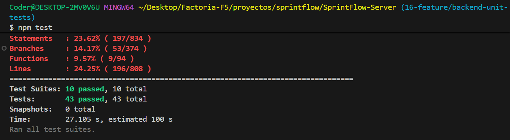

# SprintFlow - Servidor (Backend)

## 📖 Descripción General

SprintFlow es una aplicación completa de gestión ágil de proyectos que permite a equipos Scrum planificar, ejecutar y hacer seguimiento de sprints de manera eficiente. Este repositorio contiene el **backend** de la aplicación, una API RESTful construida con Node.js, Express y MongoDB.

### 🎯 Objetivo del Proyecto

SprintFlow facilita la gestión de sprints mediante:
- **Planificación de Sprints**: Definición de historias de usuario con puntos de complejidad
- **Asignación de Recursos**: Distribución de horas por desarrollador
- **Seguimiento en Tiempo Real**: Monitoreo del progreso y puntos completados
- **Reportes y Métricas**: Análisis de rendimiento y cumplimiento de objetivos
- **Gestión de Equipos**: Control de usuarios con dos roles diferentes: Admin y Developer.

## 🔄 Relación con el Cliente

Este servidor trabaja en conjunto con [SprintFlow-Client](../SprintFlow-Client), una aplicación React que proporciona la interfaz de usuario.

**Arquitectura del Sistema:**
```
┌─────────────────────────────────────┐
│   SprintFlow-Client (Frontend)      │
│   - React + Vite                    │
│   - Material-UI (MUI)               │
│   - Zustand (State Management)      │
│   - Puerto: 5173                    │
└──────────────┬──────────────────────┘
               │ HTTP/REST API
               │ (JWT Authentication)
┌──────────────▼──────────────────────┐
│   SprintFlow-Server (Backend)       │
│   - Node.js + Express               │
│   - MongoDB + Mongoose              │
│   - JWT Authentication              │
│   - Puerto: 4000                    │
└─────────────────────────────────────┘
```

### Flujo de Comunicación

1. **Autenticación**: El cliente envía credenciales → El servidor valida y retorna un JWT
2. **Autorización**: Cada petición incluye el JWT en headers → El servidor verifica permisos
3. **Operaciones CRUD**: El cliente realiza peticiones → El servidor procesa y responde con datos
4. **Persistencia**: Todos los datos se almacenan en MongoDB

## Tecnologías Utilizadas

- **Node.js**: Entorno de ejecución JavaScript
- **Express**: Framework web para Node.js
- **MongoDB**: Base de datos NoSQL
- **Mongoose**: ODM (Object Data Modeling) para MongoDB
- **JWT (JSON Web Tokens)**: Autenticación y autorización
- **bcrypt**: Hashing de contraseñas
- **dotenv**: Gestión de variables de entorno
- **CORS**: Habilitación de peticiones cross-origin

## Instalación y Configuración

### Prerrequisitos
- Node.js (v16 o superior)
- MongoDB (local o Atlas)
- Cliente SprintFlow corriendo en puerto 5173

### Pasos de Instalación

1. **Clonar el repositorio**
```bash
git clone https://github.com/SprintFlow/SprintFlow-Server.git
cd SprintFlow-Server
```

2. **Instalar dependencias**
```bash
npm install
```

3. **Configurar variables de entorno**
Crear un archivo `.env` en la raíz del proyecto:
```env
PORT=4000
MONGO_URI=mongodb://localhost:27017/sprintflow
JWT_SECRET=tu_clave_secreta_jwt
NODE_ENV=development
CLIENT_URL=http://localhost:5173
```

4. **Iniciar el servidor**
```bash
# Modo desarrollo (con nodemon)
npm run dev

# Modo producción
npm start
```

El servidor estará disponible en `http://localhost:4000`

## Estructura del Proyecto

```
SprintFlow-Server/
├── src/
│   ├── app.js                 # Configuración de Express
│   ├── config/
│   │   └── config.js          # Variables de configuración
│   ├── controllers/           # Lógica de negocio
│   │   ├── AuthController.js
│   │   ├── UserController.js
│   │   ├── sprintController.js
│   │   ├── completionController.js
│   │   └── PointsRegistryController.js
│   ├── database/
│   │   └── db_connection.js   # Conexión a MongoDB
│   ├── middlewares/           # Middlewares personalizados
│   │   ├── authMiddleware.js
│   │   ├── roleMiddleware.js
│   │   └── sprintStatusMiddleware.js
│   ├── models/                # Esquemas de MongoDB
│   │   ├── UserModel.js
│   │   ├── Sprint.js
│   │   ├── Completion.js
│   │   └── PointsRegistryModel.js
│   ├── routes/                # Definición de rutas
│   │   ├── AuthRoutes.js
│   │   ├── UserRoutes.js
│   │   ├── sprintRoutes.js
│   │   ├── CompletionRoutes.js
│   │   └── pointsRegistryRoutes.js
│   ├── utils/
│   │   └── handleJWT.js       # Utilidades para JWT
│   └── validations/
│       └── UserValidations.js
├── test/                      # Tests unitarios
│   └── sprint.test.js
├── index.js                   # Punto de entrada
├── package.json
└── README.md
```

## API Documentation

### 🔗 Base URL

```
http://localhost:4000/api
```

## Autenticación JWT

Todos los endpoints protegidos requieren un token JWT en el header de autorización:

```
Authorization: Bearer {tu_token_jwt}
```

El token se obtiene al hacer login o registrarse y tiene la siguiente estructura:

**Payload del Token:**
```json
{
  "id": "user_id",
  "email": "user@example.com",
  "role": "Developer",
  "isAdmin": false,
  "iat": 1234567890,
  "exp": 1234654290
}
```

**Tiempo de Expiración:** 24 horas

---

## Roles de Usuario

El sistema implementa un control de acceso basado en roles (RBAC):

### Developer (Desarrollador)

**Permisos:**
- ✅ Registrarse y hacer login
- ✅ Ver su propia información de perfil
- ✅ Actualizar su perfil (nombre, email, avatar)
- ✅ Cambiar su contraseña
- ✅ Ver sprints asignados
- ✅ Registrar puntos completados en sus sprints
- ✅ Ver sus propias estadísticas y registros

**Restricciones:**
- ❌ No puede ver información de otros usuarios
- ❌ No puede crear, editar o eliminar sprints
- ❌ No puede modificar roles de usuarios
- ❌ No puede acceder al panel de administración

### Admin (Administrador)

**Permisos:** Control total del sistema
- ✅ Todos los permisos de Scrum Master
- ✅ **Ver todos los usuarios del sistema**
- ✅ **Crear, editar y eliminar usuarios**
- ✅ **Modificar roles de cualquier usuario**
- ✅ **Eliminar sprints**
- ✅ Acceso completo a todos los endpoints
- ✅ Gestión completa de configuración del sistema

---

## Códigos de Estado HTTP

| Código | Significado | Descripción |
|--------|-------------|-------------|
| 200 | OK | Petición exitosa |
| 201 | Created | Recurso creado exitosamente |
| 400 | Bad Request | Datos inválidos o faltantes |
| 401 | Unauthorized | Token inválido o expirado |
| 403 | Forbidden | Sin permisos para realizar la acción |
| 404 | Not Found | Recurso no encontrado |
| 409 | Conflict | Conflicto (ej: email duplicado) |
| 500 | Internal Server Error | Error del servidor |

---

## Testing

El proyecto incluye tests unitarios para validar el funcionamiento de los modelos y controladores. Los tests están implementados con **Jest** y **MongoDB Memory Server** para pruebas aisladas.

### Ejecutar Tests

```bash
# Ejecutar todos los tests
npm test

# Ejecutar tests en modo watch
npm run test:watch

# Ver cobertura de tests
npm run test:coverage
```

### Ejemplo de Tests

Los tests cubren los modelos principales del sistema (User, Sprint, etc.) y validan:
- ✅ Creación de registros
- ✅ Validaciones de campos
- ✅ Operaciones CRUD
- ✅ Reglas de negocio
- ✅ Relaciones entre modelos



> 📄 Para más información sobre los tests, consulta el archivo [SECURITY_CHECKLIST.md](./SECURITY_CHECKLIST.md)

---

## Variables de Entorno

Configuración requerida en archivo `.env`:

| Variable | Descripción | Ejemplo |
|----------|-------------|---------|
| `PORT` | Puerto del servidor | `4000` |
| `MONGO_URI` | URI de MongoDB | `mongodb://localhost:27017/sprintflow` |
| `JWT_SECRET` | Clave secreta para JWT | 
| `NODE_ENV` | Entorno de ejecución | `development` o `production` |
| `CLIENT_URL` | URL del cliente | `http://localhost:5173` |

---

## Despliegue

### Desarrollo
```bash
npm run dev
```

### Producción
```bash
npm start
```

---

## Contribución

1. Fork el proyecto
2. Crea una rama para tu feature (`git checkout -b feature/AmazingFeature`)
3. Commit tus cambios (`git commit -m 'Add some AmazingFeature'`)
4. Push a la rama (`git push origin feature/AmazingFeature`)
5. Abre un Pull Request

---

## Notas Importantes

- **Seguridad**: Las contraseñas se hashean con bcrypt antes de almacenarse
- **CORS**: Configurado para aceptar peticiones del cliente en puerto 5173
- **Validaciones**: Todos los endpoints validan los datos de entrada
- **Tokens**: Los JWT expiran después de 24 horas
- **Base de Datos**: MongoDB con Mongoose para modelado de datos
- **Middleware**: Sistema de autenticación y autorización por roles

---

## Contacto

Para dudas o sugerencias sobre el backend de SprintFlow, contacta al equipo de desarrollo.

---

## 📄 Licencia

Este proyecto es privado y pertenece al equipo SprintFlow.

---
